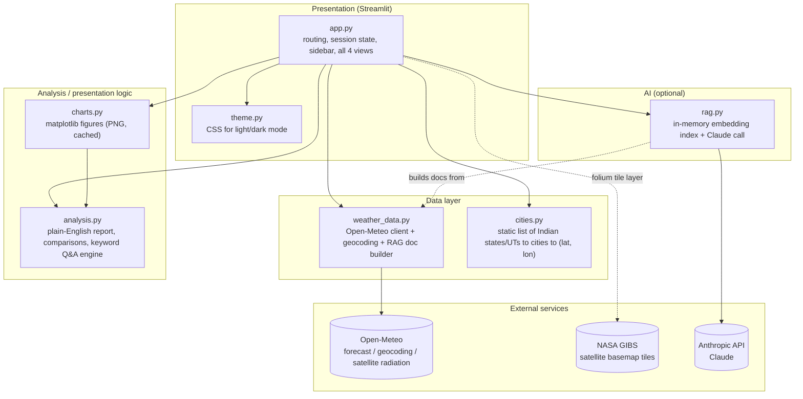
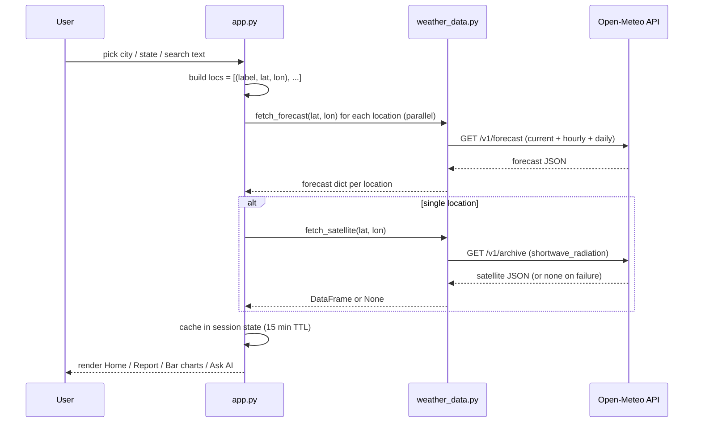
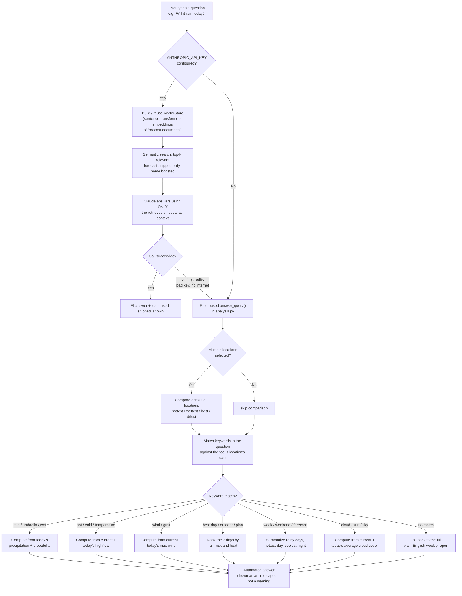
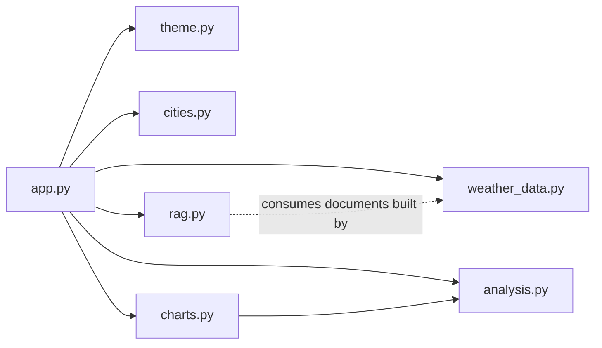
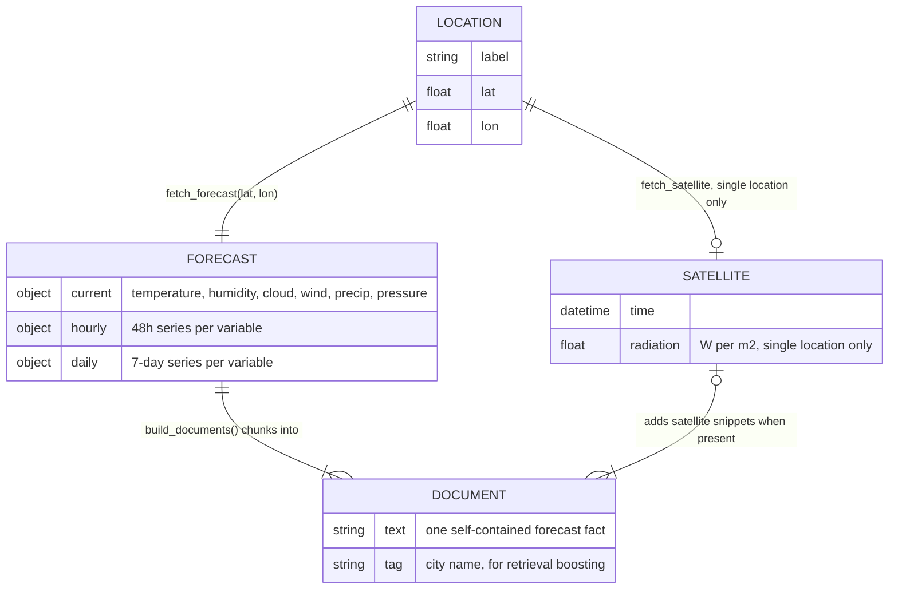

# 🛰️ India Weather — Satellite Forecasts + RAG

A [Streamlit](https://streamlit.io) dashboard for weather across India: live forecasts, satellite
imagery, plain‑English reports, and a chat assistant that answers questions about the forecast.

The assistant works two ways:

- **With an `ANTHROPIC_API_KEY`** — questions are answered by Claude, grounded in the fetched
  forecast data via a small retrieval‑augmented generation (RAG) pipeline.
- **Without a key** — questions are answered by a **rule‑based analysis engine** that reads your
  question, pulls the relevant numbers straight out of the live Open‑Meteo data, and writes a
  direct answer. No LLM, no API cost, always available.

Either way, every answer is grounded in the same real‑time forecast — the AI path just phrases it
more flexibly.

---

## Contents

- [Features](#features)
- [How it works](#how-it-works)
- [Architecture](#architecture)
- [Ask AI: how a question gets answered](#ask-ai-how-a-question-gets-answered)
- [Module map](#module-map)
- [Data model](#data-model)
- [Project structure](#project-structure)
- [Setup](#setup)
- [Configuration](#configuration)
- [Usage](#usage)
- [Design notes](#design-notes)
- [Limitations](#limitations)

---

## Features

| Area | What it does |
|---|---|
| 📍 **Location picker** | Browse by city, by state/UT (all cities, or every state at once), or free‑text search (geocoded via Open‑Meteo). |
| 🏠 **Home** | Current conditions, 7‑day metrics, hourly charts (temperature / rain chance / cloud cover), satellite‑derived solar radiation, and a live NASA GIBS satellite map. |
| 📝 **Weather report** | A plain‑English forecast narrative — headline, next‑24‑hours outlook, highlights, suggestions, and a day‑by‑day breakdown — generated entirely from data, no AI required. |
| 📊 **Bar charts** | Matplotlib charts for temperature, rain, cloud, wind, and (in multi‑location mode) cross‑location comparisons. |
| 💬 **Ask AI** | A chat interface for free‑form questions about the forecast, answered by Claude (if configured) or the built‑in analysis engine. |
| 🌙 **Dark mode** | Toggle in the sidebar; charts and CSS both respect it. |
| ⚡ **Caching** | Geocoding (1 h), forecasts (15 min), and rendered chart images are all cached so switching pages/views is instant. |

---

## How it works

```mermaid
flowchart LR
    U["🧑 User"] -->|picks a place| APP["Streamlit app (app.py)"]
    APP -->|lat/lon| WD["weather_data.py"]
    WD -->|HTTPS| OM["Open-Meteo API\n(forecast + geocoding + satellite)"]
    WD -->|HTTPS| NASA["NASA GIBS\n(satellite tile imagery)"]
    OM --> WD
    WD -->|forecast JSON| APP
    APP --> HOME["Home"]
    APP --> REPORT["Report"]
    APP --> BARS["Bar charts"]
    APP --> ASK["Ask AI"]
    HOME --> FOLIUM["folium map"] --> NASA
    REPORT --> AN["analysis.py"]
    BARS --> CH["charts.py"]
    ASK --> LOGIC{"ANTHROPIC_API_KEY set?"}
    LOGIC -->|yes| RAG["rag.py\n(embeddings + Claude)"]
    LOGIC -->|no| AN
    RAG -->|API call| CLAUDE["Anthropic API\n(Claude)"]
    AN --> ANSWER["Answer shown in chat"]
    RAG --> ANSWER
```



**In short:** the app fetches live forecast data for whatever location you pick, renders it across
four views, and answers free‑text questions either by asking Claude (with the forecast as
grounding context) or by running the same forecast data through a rule‑based analyzer when no key
is configured.

---

## Architecture

### Component overview



### Sequence: loading a location



---

## Ask AI: how a question gets answered

This is the most interesting part of the app — the same question can be answered two different
ways depending on configuration, and the fallback path is a real analysis engine, not just an
error message.



Both paths read the **same forecast data already sitting in session state** — the fallback isn't a
degraded experience, it's a second, deterministic way of answering that never needs network access
to a third‑party LLM.

---

## Module map



| File | Responsibility |
|---|---|
| `app.py` | Streamlit entry point: page config, sidebar (location picker, dark mode, refresh), session‑state caching, and the four views (Home, Report, Bar charts, Ask AI). Owns the `HAS_KEY` check and the `reply()` routing between Claude and the built‑in analyzer. |
| `weather_data.py` | Thin HTTP client for Open‑Meteo (geocoding, forecast, satellite radiation) plus `build_documents()`, which chunks a forecast into short text passages for the RAG index. |
| `analysis.py` | Pure functions, no I/O: turns a forecast dict into a plain‑English report (`report`/`to_markdown`), cross‑location comparisons (`compare`), and the keyword‑driven Q&A engine (`answer_query` → `single_answer` / `multi_answer`). |
| `charts.py` | Matplotlib figure builders (bars, grouped bars, horizontal bars) styled for light/dark mode; results are cached as PNG bytes by `app.py`. |
| `rag.py` | Minimal RAG: embeds documents with `sentence-transformers` (`all-MiniLM-L6-v2`), does cosine‑similarity retrieval with a same‑city boost, then asks Claude to answer using only the retrieved snippets. |
| `theme.py` | CSS injected via `st.markdown` for the light/dark visual theme. |
| `cities.py` | Static lookup: state/UT → list of `(city, lat, lon)`. |

---

## Data model



Session state holds `data: {label: (location, forecast)}`, the optional `sat` DataFrame, the
current `scope`/`focus`, the `chat` history, and a lazily‑built `store` (the `VectorStore` used by
Ask AI), rebuilt only when the underlying data actually changes.

---

## Project structure

```
weather-rag/
├── app.py              # Streamlit app: routing, sidebar, 4 views, Ask AI orchestration
├── analysis.py          # Data → plain-English report, comparisons, keyword Q&A engine
├── charts.py             # Matplotlib chart builders
├── weather_data.py       # Open-Meteo client + RAG document builder
├── rag.py                 # Embedding index + Claude-backed answer()
├── cities.py               # Static India states/UTs → cities → (lat, lon)
├── theme.py                # Light/dark CSS
├── requirements.txt
├── .env.example             # Template for ANTHROPIC_API_KEY / CLAUDE_MODEL
├── .streamlit/config.toml
└── config.toml
```

---

## Setup

**Requirements:** Python 3.9+.

```bash
git clone <this-repo-url>
cd weather-rag
pip install -r requirements.txt
```

### API key (optional, enables the AI chat answers)

```bash
cp .env.example .env
# then edit .env and set ANTHROPIC_API_KEY=sk-ant-...
```

The key is loaded automatically at startup via `python-dotenv` (`load_dotenv()` in `app.py`).
Without it, **the app still runs fully** — the Ask AI tab answers using the built‑in analysis
engine instead of Claude.

### Run

```bash
streamlit run app.py
```

---

## Configuration

| Variable | Required | Default | Purpose |
|---|---|---|---|
| `ANTHROPIC_API_KEY` | No | — | Enables Claude‑backed answers in Ask AI. Read via `os.getenv` after `load_dotenv()`. |
| `CLAUDE_MODEL` | No | `claude-sonnet-5` | Overrides the model used in `rag.py`. |

No key is required for weather data itself — Open‑Meteo and NASA GIBS are used unauthenticated.

---

## Usage

1. **Pick a location** in the sidebar: a single city, an entire state/UT (or all states at once,
   one city each), or search any place name.
2. Switch between **Home**, **Report**, **Bar charts**, and **Ask AI** using the top navigation.
3. In **Ask AI**, type a question or click one of the example chips. Try:
   - *"Will it rain today?"*
   - *"How hot will it get?"*
   - *"Best day this week for outdoor plans?"*
   - With multiple locations selected: *"Which city is hottest today?"*, *"Where is the weather
     best this weekend?"*
4. Press **Refresh data** in the sidebar to bypass the cache and re‑fetch immediately.

---

## Design notes

- **The built‑in analyzer is a first‑class feature, not a fallback message.** When no API key is
  set, `analysis.answer_query()` parses the question for intent (rain, heat, wind, best day, week
  overview, sky) and computes a real, numeric answer from the same forecast data — it never just
  says "no key configured." The chat UI reflects this: no‑key answers show a neutral caption
  ("Automated answer, computed from the live forecast data"), while an actual AI failure (bad key,
  no credits, no internet) shows a warning and explains what went wrong.
- **RAG is intentionally small.** Documents are short, self‑contained sentences (current
  conditions, one per forecast day, optional 6‑hour windows, optional satellite summaries) rather
  than raw JSON — this keeps retrieval accurate and keeps Claude from having to parse structured
  data itself.
- **Everything is cached.** Geocoding results (1h), forecasts (15m), and rendered chart PNGs are
  cached with `st.cache_data`, and the embedding index is rebuilt only when the location/forecast
  actually changes (tracked via a `(key, fetched)` signature).

---

## Limitations

- Satellite‑derived solar radiation and the "data used" retrieval expander are only shown for a
  single selected location (not state‑wide or all‑India views).
- The rule‑based Q&A engine matches keywords, not full natural‑language intent — an oddly phrased
  question may fall back to the general weekly report instead of a targeted answer.
- Forecast data is Open‑Meteo's numerical model output; accuracy decreases for days 5–7, as noted
  in the generated reports.

---

## Troubleshooting

**"AI answer unavailable: the API key is missing or invalid" — even after adding the key**

This almost always means the key in `.env` isn't actually the one reaching the process. Common
causes, in order of likelihood:

1. **You edited `.env` without restarting the app.** `python-dotenv` won't overwrite an
   environment variable that's already set in the process — if the app first ran with a
   missing/blank key, that value can stick around even after you fix `.env`, because Streamlit's
   auto-rerun re-executes the *script* but not the *process*. `app.py` calls
   `load_dotenv(override=True)` specifically to fix this, but if you're still stuck: stop Streamlit
   fully (`Ctrl+C`) and run `streamlit run app.py` again.
2. **The wrong `.env` file is being loaded.** `app.py` now loads `.env` from an explicit path —
   the same folder as `app.py` itself (`Path(__file__).resolve().parent / ".env"`) — rather than
   letting `python-dotenv` search upward through parent folders, which can otherwise pick up an
   unrelated `.env` from your home directory or another project with no indication anything went
   wrong. The sidebar's **ℹ️ How to use** panel shows the exact path being used and whether the
   file was found there — check that it matches where you actually created `.env`.
3. **Stray quotes or whitespace in `.env`.** A trailing space or a line break in the middle of the
   key will produce this error. `rag.get_api_key()` strips surrounding quotes/whitespace
   automatically and will tell you specifically if whitespace is still embedded in the key.
4. **Wrong variable name.** It must be exactly `ANTHROPIC_API_KEY`.
5. **The key itself is invalid, expired, or revoked.** The sidebar shows a masked version of the
   key actually in use (e.g. `sk-ant-api03...cdef`) — compare it against what you pasted into
   `.env`. If it matches and the AI call still fails, the chat message itself now includes
   Anthropic's raw error text (not just a generic guess), which will say e.g.
   `invalid x-api-key` (the key is wrong/revoked) vs. a credits/billing message vs. a rate-limit
   message — each needs a different fix (regenerate the key, add credits, or wait, respectively).

If none of that helps, the app still works — the Ask AI tab automatically falls back to the
built‑in, data‑driven answer engine (see [Ask AI: how a question gets answered](#ask-ai-how-a-question-gets-answered)).

