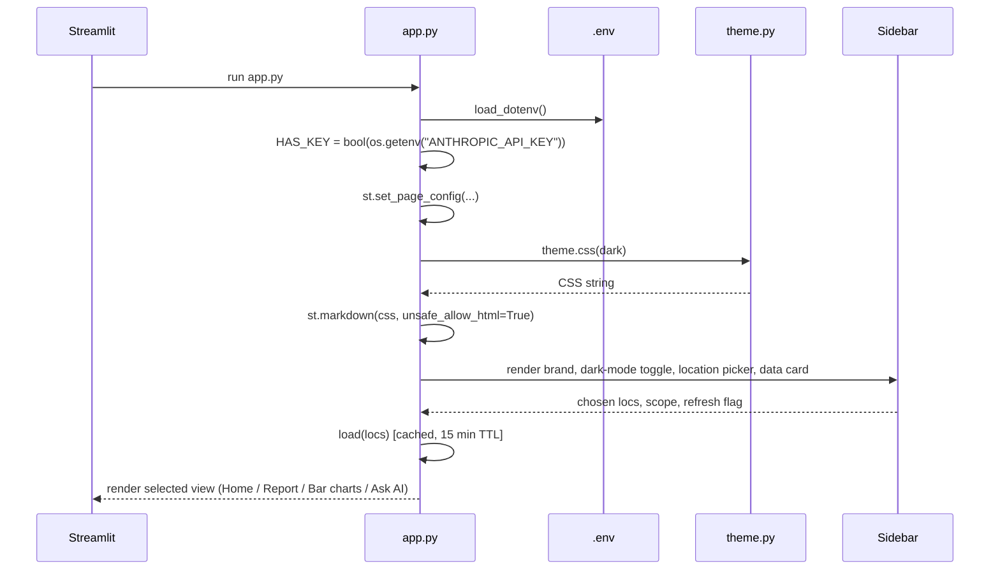
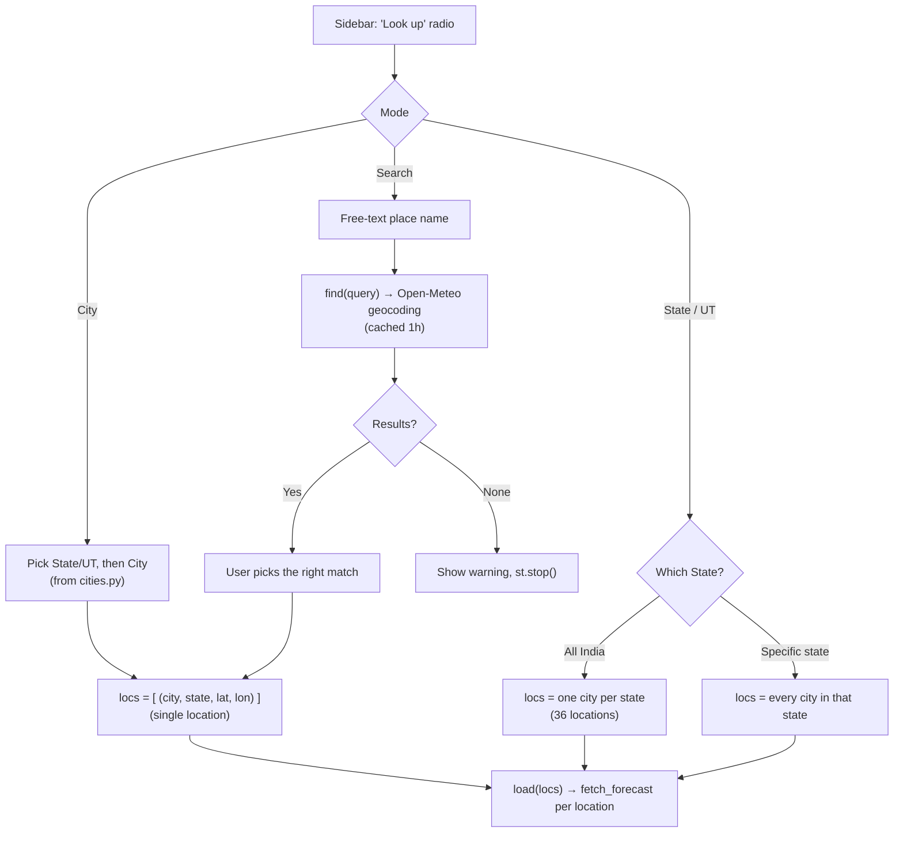
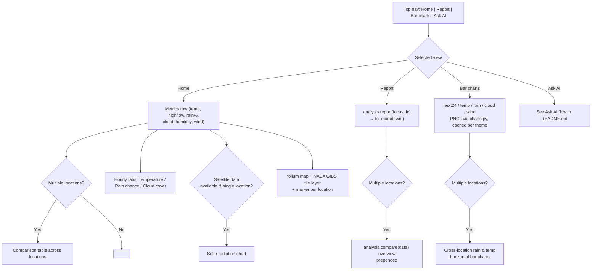
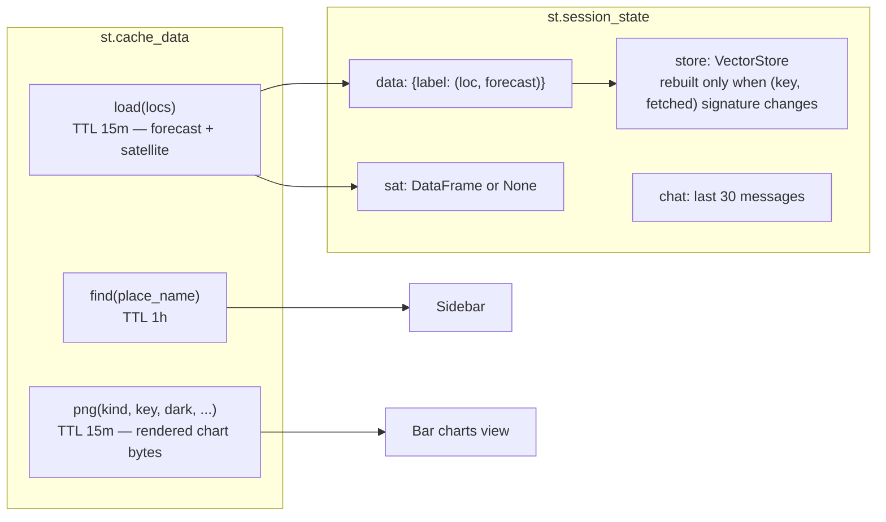
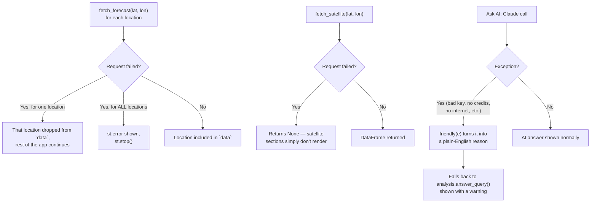

# Architecture deep‑dive

This document goes one level deeper than the main [README](../README.md): how the app boots,
how each of the four views renders, how caching works, and how a location moves through the app
end to end. See the README for the high‑level component diagram and the Ask AI decision flow.

---

## App boot sequence

---

## Sidebar → location resolution

The sidebar supports three independent ways to choose what to show, all normalized into the same
`locs: [(label, lat, lon), ...]` shape before data loading.

---

## Per‑view rendering

---

## Caching layers

Pressing **Refresh data** calls `st.cache_data.clear()`, which invalidates `find`, `load`, and
`png` together, forcing a fresh fetch on the next run.

---

## Error handling paths

---

## Where to look for what

| I want to change... | Edit... |
|---|---|
| Which cities/states are selectable | `cities.py` |
| Forecast fields fetched from Open‑Meteo | `weather_data.py` → `fetch_forecast` |
| Wording of the plain‑English report | `analysis.py` → `report`, `to_markdown` |
| What the built‑in Q&A engine can answer | `analysis.py` → `single_answer`, `multi_answer` |
| Chart appearance | `charts.py` |
| Light/dark colors and CSS | `theme.py` |
| RAG prompt / retrieval behavior | `rag.py` |
| Page layout, sidebar, session‑state, routing | `app.py`|
